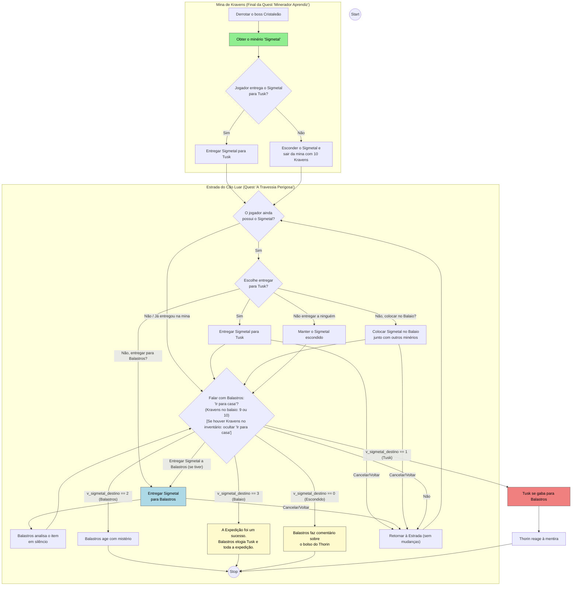

# Fluxo sigmetal

```mermaid
flowchart TD
%% =====================================================
%% Fluxo de Decisão do Item "Sigmetal" (Mermaid robusto)
%% =====================================================

%% ---- Estilos aproximando as cores do .puml ----
classDef green fill:#90EE90,stroke:#555,color:#000;
classDef coral fill:#F08080,stroke:#555,color:#000;
classDef blue fill:#ADD8E6,stroke:#555,color:#000;
classDef yellow fill:#FFFACD,stroke:#555,color:#000;

%% ---- Nós de início/fim ----
START((Start))
END((Stop))

%% ---- Estado/Variáveis ----
%% v_sigmetal_destino: 0=Player (escondido) | 1=Tusk | 2=Balastros | 3=Balaio
%% Checagem de encerramento usa inventário: Kravens removidos do inventário => no balaio

%% =====================================================
%% Partição: Mina de Kravens (Final da Quest "Minerador Aprendiz")
%% =====================================================
subgraph KRAVENS["Mina de Kravens (Final da Quest 'Minerador Aprendiz')"]
    A1["Derrotar o boss Cristaleão"]
    A2["Obter o minério 'Sigmetal'"]:::green

    %% Nota/Vars: O jogador agora possui o item de quest.
    %%  PLAYER_HAS_SIGMETAL=true; v_sigmetal_destino=0

    A3{"Jogador entrega o Sigmetal<br>para Tusk?"}

    A4["Entregar Sigmetal para Tusk"]
    %% Flags/Vars:
    %%  PLAYER_HAS_SIGMETAL=false; TUSK_CREDIT=true; v_sigmetal_destino=1

    A5["Esconder o Sigmetal e<br>sair da mina com 10 Kravens"]
    %% Flags/Vars:
    %%  PLAYER_HAS_SIGMETAL=true; TUSK_CREDIT=false; v_sigmetal_destino=0

    A1 --> A2
    A2 --> A3
    A3 -- "Sim" --> A4
    A3 -- "Não" --> A5
end

%% Se entregou na mina, segue viagem até a Estrada (Tusk fica com o Sigmetal)
A4 --> B1

%% Se escondeu, prossegue (viagem/combates etc.)
A5 --> B1

%% =====================================================
%% Partição: Estrada do Cão Luar (Quest "A Travessia Perigosa")
%% =====================================================
subgraph ESTRADA["Estrada do Cão Luar (Quest 'A Travessia Perigosa')"]
    B1{"O jogador ainda<br>possui o Sigmetal?"}

    %% --- Ramo SIM: múltiplas decisões ---
    B2{"Escolhe entregar<br>para Tusk?"}
    B3["Entregar Sigmetal para Tusk"]
    %% Vars: v_sigmetal_destino=1; PLAYER_HAS_SIGMETAL=false

    B4["Entregar Sigmetal<br>para Balastros"]:::blue
    %% Vars: v_sigmetal_destino=2; PLAYER_HAS_SIGMETAL=false; BALASTROS_KNOWS=true
    B5["Balastros analisa o item<br>em silêncio"]
    B6["Balastros age com mistério"]
    %% Nota: B5/B6 são cenas; não alteram estado

    B7["Colocar Sigmetal no Balaio<br>junto com outros minérios"]
    B8["A Expedição foi um sucesso.<br>Balastros elogia Tusk e toda a expedição."]:::yellow
    %% Flags/Vars:
    %%  PLAYER_HAS_SIGMETAL=false; SIGMETAL_LOST_TO_CHEST=true; v_sigmetal_destino=3

    B9["Manter o Sigmetal escondido"]
    B10["Balastros faz comentário sobre<br>o bolso do Thorin"]:::yellow
    %% Flags/Vars:
    %%  PLAYER_HAS_SIGMETAL=true; v_sigmetal_destino=0

    %% --- Ramo NÃO: já entregou antes (Tusk ficou com o Sigmetal) ---
    B1 -- "Não / Já entregou na mina" --> D1

    %% Encadeamentos do ramo SIM
    B1 -- "Sim" --> B2
    B2 -- "Sim" --> B3
    B2 -- "Não, entregar para Balastros?" --> B4
    B2 -- "Não, colocar no Balaio?" --> B7
    B2 -- "Não entregar a ninguém" --> B9

    %% Desdobramentos dos caminhos alternativos
    B3 --> D1
    B4 --> B5
    B5 --> D1
    B6 --> END
    B7 --> D1
    B8 --> END
    B9 --> D1
    B10 --> END

    %% Opções de cancelar/voltar nas interações
    B3 -- "Cancelar/Voltar" --> R0
    B4 -- "Cancelar/Voltar" --> R0
    B7 -- "Cancelar/Voltar" --> R0
end

%% =====================================================
%% Cena comum: Tusk toma o crédito (label TuskTakesCredit)
%% =====================================================
C1["Tusk se gaba para Balastros"]:::coral
C2["Thorin reage à mentira"]

%% =====================================================
%% Gate de Encerramento: Falar com Balastros e 'Ir para casa'
%% (pré-requisito: Kravens no balaio — itens removidos do inventário)
%% =====================================================
D1{"Falar com Balastros:\n'Ir para casa'?\n(Kravens no balaio: 9 ou 10)\n[Se houver Kravens no inventário: ocultar 'Ir para casa']"}

%% Saídas condicionais (inventário de Kravens vazio e v_sigmetal_destino)
D1 -- "v_sigmetal_destino == 1 (Tusk)" --> C1
D1 -- "v_sigmetal_destino == 2 (Balastros)" --> B6
D1 -- "v_sigmetal_destino == 3 (Balaio)" --> B8
D1 -- "v_sigmetal_destino == 0 (Escondido)" --> B10

%% Opção dentro do diálogo de Balastros para entregar o Sigmetal (se possuir)
D1 -- "Entregar Sigmetal a Balastros (se tiver)" --> B4

%% Opção de retorno sem encerrar a missão
D1 -- "Não" --> R0
R0["Retornar à Estrada (sem mudanças)"]
R0 --> B1

C1 --> C2
C2 --> END
```
